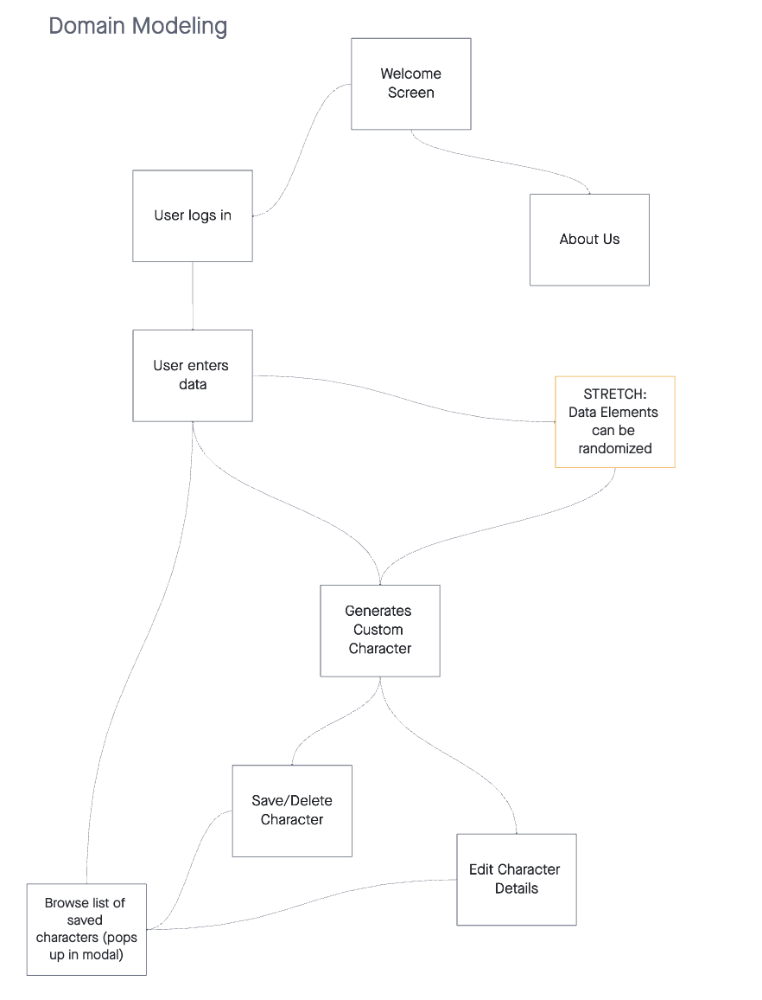
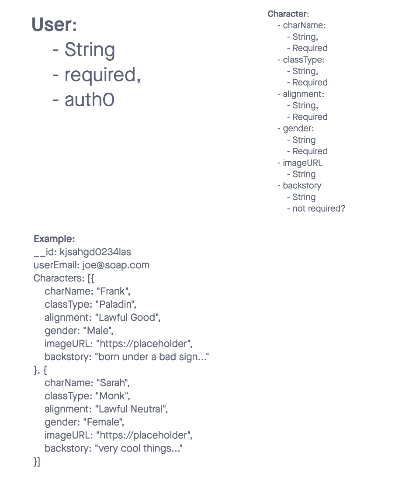

## Introduction

LoreCraft is a background story generator for Fantasy settings

Crafting an entire story is time consuming, and valuable to the engagement a player feels when playing with this character.

We feel that it is much nicer to edit a backstory than generate one - we’re letting AI stick to its strengths, and humans to theirs!

## Scope

### IN scope
- user-specific details (via auth0 login)
- input characteristics of a character before creation
- provide a photo of the character
- ability to favorite/save characters
- ability to edit a characters backstory

### OUT of scope
- edit all details of the characters appearance
- highly specific prompts to what the image might look like
- sharing character details within the app
- editing characteristics of a character once generated (except for their backstory)

## Minimum Viable Product

### MVP Functionality
- Welcome Screen
- An About Us Screen
- A form screen that allows one to enter race/alignment/etc into form
- A character background is returned
- An image of the character is provided
- There is the ability to save/favorite character (if logged in)
- Also an ability to edit any of the returned details

### Stretch GoalsS
- expand from fantasy persona generator to any (e.g. brand marketing personas)
- ability to enter custom OpenAI key
- Ability to further customize appearance
- Share a publicly available link to a character

Data Flow

             +-------------+
             |   UserModel |
             +-------------+
             | userEmail   |
             |-------------|
             | characters[]|
             +------+------+
                    |
                    |
                    |
           +--------v---------+
           |  CharacterSchema |
           +------------------+
           | charName         |
           | classType        |
           | alignment        |
           | gender           |
           | imageURL         |
           | backstory        |
           +------------------+

## Non-Functional Requirements

The non-functional requirements of our Fantasy background story generator focus on usability, and security.

### Usability
We prioritize a responsive user experience through an intuitive user interface, where one can easily input character details, view generated backgrounds, and save or edit them if logged in. Our system aims for fast response times, generating characters and their backgrounds within seconds to maintain user engagement.

### Security
Auth0 login functionalities, we ensure that users' specific details and saved characters are stored securely, enhancing the trust and reliability of our application. Overall, the non-functional requirements serve to elevate the core functionalities, making the app not just functional but also efficient, secure, and enjoyable to use.

## Database Schema

(

